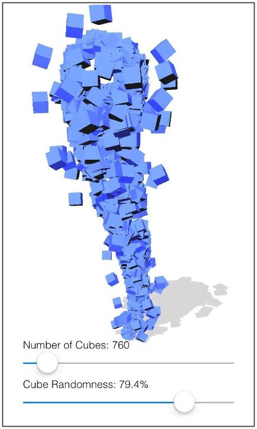

# Cubenado
OpenGL ES 3.0 demo for iOS

The goal for this demo is to animate a tornado of cubes with a high degree of adjustability in cube motion, as well as being able to handle up to 10K cubes with excellent framerate performance.

## Implementation
The curvature of the tornado is modeled using a 3rd degree Bezier curve.  Particle motion is simulated using transform feedback resulting in cubes that oribit around the tangents of the tornado Bezier curve.  At each frame, after particle simulation, the particles are rendered as instanced cubes, each with their own unique axis of orientation and position. 

Increasing the cube randomness slider affects various aspects of the tornado motion:
* Each cube is rotated about a unique axis by an angle proportional to cube randomness.
* Debris particles are generated in greater amounts for higher randomness values.
* Rotational movement of tornado end points is increased.
* Rotational speed of cube particles is greater for higher values of cube randomness. 

## Performance Measure
Below is a screen shot taken with XCode GPU Report of Cubenado running on an Apple A7 GPU.  Average 52fps was reported when simulating and rendering 10k cube particles.

